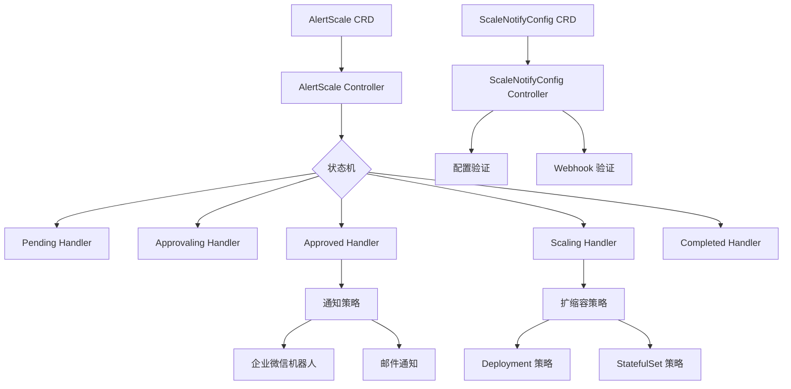

# Udesk Ops Operator

[](https://golang.org/)
[](https://kubernetes.io/)
[](https://opensource.org/licenses/Apache-2.0)
[](./UNIT_TEST_SUMMARY.md)

> 🚀 企业级 Kubernetes 扩缩容操作器，支持智能审批流程和多通道通知系统

## 概述

Udesk Ops Operator 是一个基于 Kubernetes Operator 模式构建的企业级扩缩容管理工具。它提供了完整的扩缩容生命周期管理，包括自动化审批流程、多通道通知系统和灵活的策略配置。

## 核心特性

### 🎯 智能扩缩容管理
- **状态机驱动**: 基于状态机模式的扩缩容流程控制
- **多策略支持**: 支持 Deployment 和 StatefulSet 扩缩容
- **自动审批**: 可配置的自动/手动审批机制
- **超时控制**: 可配置的操作超时和重试机制

### 📢 多通道通知系统
- **企业微信机器人**: 支持企业微信群聊机器人通知
- **邮件通知**: 支持 SMTP 邮件通知系统
- **模板引擎**: 基于 Go template 的消息模板定制
- **通知验证**: 自动验证通知配置有效性

### 🔧 灵活配置管理
- **CRD 配置**: 基于 Kubernetes CRD 的配置管理
- **Webhook 验证**: 自动配置验证和冲突检测
- **默认配置**: 支持默认通知配置设置
- **配置热更新**: 支持运行时配置更新

### 🛡️ 企业级特性
- **RBAC 集成**: 完整的 Kubernetes RBAC 支持
- **监控集成**: 支持 Prometheus 监控指标
- **日志审计**: 完整的操作日志记录
- **高可用**: 支持多副本部署和故障转移

## 架构设计



## 快速开始

### 前置要求

- Kubernetes 集群 1.30+
- kubectl 命令行工具
- Golang 1.24+ (开发环境)

### 安装部署

#### 1. 部署 CRD 和 Controller

```bash
# 克隆代码库
git clone https://github.com/your-org/udesk-ops-operator.git
cd udesk-ops-operator

# 安装 CRD
make install

# 部署 Controller
make deploy IMG=your-registry/udesk-ops-operator:latest
```

#### 2. 配置通知

创建企业微信机器人通知配置：

```yaml
apiVersion: ops.udesk.cn/v1beta1
kind: ScaleNotifyConfig
metadata:
  name: wxwork-notify
  namespace: default
spec:
  notificationType: WXWorkRobot
  isDefault: true
  config: |
    {
      "webhookURL": "https://qyapi.weixin.qq.com/cgi-bin/webhook/send?key=your-key",
      "secret": "your-secret",
      "messageTemplate": "{{.AlertName}} 扩缩容操作：{{.Status}} 时间：{{.Timestamp}}"
    }
```

创建邮件通知配置：

```yaml
apiVersion: ops.udesk.cn/v1beta1
kind: ScaleNotifyConfig
metadata:
  name: email-notify
  namespace: default
spec:
  notificationType: Email
  config: |
    {
      "smtpServer": "smtp.example.com",
      "smtpPort": 587,
      "fromEmail": "alerts@example.com",
      "toEmails": ["admin@example.com", "ops@example.com"],
      "username": "alerts@example.com",
      "password": "your-password",
      "subject": "扩缩容通知",
      "messageTemplate": "应用 {{.AlertName}} 扩缩容状态更新为：{{.Status}}"
    }
```

#### 3. 创建扩缩容任务

```yaml
apiVersion: ops.udesk.cn/v1beta1
kind: AlertScale
metadata:
  name: webapp-scale
  namespace: default
spec:
  scaleTarget:
    kind: Deployment
    name: webapp
    namespace: default
  scaleReplicas: 5
  scaleDuration: "30m"
  scaleAutoApproval: false
  scaleTimeout: "10m"
  scaleNotificationType: WXWorkRobot
  scaleDescription: "应对高流量扩容"
```

### 本地开发

```bash
# 安装依赖
make deps

# 运行测试
make test

# 本地运行 Controller
make run

# 构建镜像
make docker-build IMG=your-registry/udesk-ops-operator:latest
```

## API 参考

### AlertScale CRD

AlertScale 是扩缩容操作的核心资源，定义了完整的扩缩容配置。

#### Spec 字段

| 字段 | 类型 | 必需 | 描述 |
|------|------|------|------|
| `scaleTarget` | `ScaleTarget` | ✅ | 扩缩容目标对象 |
| `scaleReplicas` | `int32` | ✅ | 目标副本数 |
| `scaleDuration` | `string` | ✅ | 扩缩容持续时间 |
| `scaleAutoApproval` | `bool` | ❌ | 是否自动审批 |
| `scaleTimeout` | `string` | ❌ | 审批超时时间 |
| `scaleNotificationType` | `string` | ❌ | 通知类型 |
| `scaleDescription` | `string` | ❌ | 操作描述 |

#### Status 字段

| 字段 | 类型 | 描述 |
|------|------|------|
| `status` | `string` | 当前状态 |
| `scaleBeginTime` | `metav1.Time` | 开始时间 |
| `scaleEndTime` | `metav1.Time` | 结束时间 |
| `currentReplicas` | `int32` | 当前副本数 |
| `message` | `string` | 状态消息 |

#### 状态流转

```
Pending → Approvaling → Approved → Scaling → Scaled → Completed
    ↓           ↓
 Failed     Rejected
```

### ScaleNotifyConfig CRD

ScaleNotifyConfig 定义通知配置，支持多种通知渠道。

#### Spec 字段

| 字段 | 类型 | 必需 | 描述 |
|------|------|------|------|
| `notificationType` | `string` | ✅ | 通知类型 (`WXWorkRobot`, `Email`) |
| `config` | `string` | ✅ | JSON 格式的配置 |
| `isDefault` | `bool` | ❌ | 是否为默认配置 |

#### 通知类型配置

**企业微信机器人 (WXWorkRobot)**:
```json
{
  "webhookURL": "https://qyapi.weixin.qq.com/cgi-bin/webhook/send?key=xxx",
  "secret": "SEC-xxx",
  "messageTemplate": "{{.AlertName}} 状态: {{.Status}}"
}
```

**邮件通知 (Email)**:
```json
{
  "smtpServer": "smtp.example.com",
  "smtpPort": 587,
  "fromEmail": "alerts@example.com", 
  "toEmails": ["admin@example.com"],
  "username": "alerts@example.com",
  "password": "password",
  "subject": "扩缩容通知",
  "messageTemplate": "{{.AlertName}} 状态: {{.Status}}"
}
```

## 监控和日志

### Prometheus 指标

Operator 提供以下 Prometheus 指标：

- `alertscale_total`: AlertScale 创建总数
- `alertscale_status_duration`: 各状态持续时间
- `notification_sent_total`: 通知发送总数
- `notification_errors_total`: 通知发送失败数

### 日志配置

```yaml
apiVersion: v1
kind: ConfigMap
metadata:
  name: operator-config
data:
  log-level: "info"
  log-format: "json"
```

## 故障排除

### 常见问题

#### 1. AlertScale 卡在 Pending 状态

**原因**: 可能是目标资源不存在或权限不足

**解决方案**:
```bash
# 检查目标资源
kubectl get deployment webapp -n default

# 检查 Controller 日志
kubectl logs -n udesk-ops-system deployment/udesk-ops-controller-manager
```

#### 2. 通知发送失败

**原因**: 通知配置错误或网络问题

**解决方案**:
```bash
# 检查通知配置
kubectl get scalenotifyconfig -o yaml

# 验证配置有效性
kubectl describe scalenotifyconfig wxwork-notify
```

#### 3. Webhook 验证失败

**原因**: 配置冲突或格式错误

**解决方案**:
```bash
# 检查 Webhook 日志
kubectl logs -n udesk-ops-system deployment/udesk-ops-controller-manager -c webhook

# 验证配置格式
kubectl apply --dry-run=server -f config.yaml
```

### 调试模式

启用详细日志：

```yaml
apiVersion: apps/v1
kind: Deployment
metadata:
  name: udesk-ops-controller-manager
spec:
  template:
    spec:
      containers:
      - name: manager
        args:
        - --log-level=debug
        - --log-format=text
```

## 开发指南

### 项目结构

```
udesk-ops-operator/
├── api/v1beta1/           # CRD 定义
├── cmd/                   # 主程序入口
├── config/                # 部署配置
├── internal/
│   ├── controller/        # Controller 实现
│   ├── handler/           # 状态处理器
│   ├── strategy/          # 策略实现
│   ├── types/             # 类型定义
│   └── webhook/           # Webhook 实现
├── test/                  # 测试文件
└── docs/                  # 文档
```

### 开发流程

1. **创建功能分支**
   ```bash
   git checkout -b feature/new-feature
   ```

2. **运行测试**
   ```bash
   make test
   make test-e2e  # 需要 Kind 集群
   ```

3. **代码检查**
   ```bash
   make lint
   make vet
   ```

4. **提交代码**
   ```bash
   git commit -m "feat: add new feature"
   git push origin feature/new-feature
   ```

### 贡献指南

我们欢迎社区贡献！请遵循以下步骤：

1. Fork 项目仓库
2. 创建功能分支
3. 提交代码变更
4. 确保测试通过
5. 提交 Pull Request

### 测试覆盖率

当前测试覆盖率：**19.4%**

详细测试报告请查看：[单元测试总结](./UNIT_TEST_SUMMARY.md)

## 生产环境建议

### 资源配置

```yaml
resources:
  limits:
    cpu: 500m
    memory: 512Mi
  requests:
    cpu: 100m
    memory: 128Mi
```

### 高可用配置

```yaml
replicas: 3
affinity:
  podAntiAffinity:
    preferredDuringSchedulingIgnoredDuringExecution:
    - weight: 100
      podAffinityTerm:
        labelSelector:
          matchLabels:
            app: udesk-ops-controller
        topologyKey: kubernetes.io/hostname
```

### 安全配置

- 启用 RBAC 最小权限原则
- 使用 NetworkPolicy 限制网络访问
- 启用 Pod Security Standards
- 定期轮换服务账户密钥

## 版本历史

- **v0.1.0** - 初始版本，基本扩缩容功能
- **v0.2.0** - 添加通知系统和审批流程
- **v0.3.0** - 增强 Webhook 验证和监控指标

## 许可证

本项目基于 [Apache License 2.0](LICENSE) 开源协议。

## 联系我们

- **项目维护者**: Udesk Ops Team
- **邮箱**: ops@udesk.com
- **问题反馈**: [GitHub Issues](https://github.com/your-org/udesk-ops-operator/issues)
- **社区讨论**: [GitHub Discussions](https://github.com/your-org/udesk-ops-operator/discussions)

---

⭐ 如果这个项目对你有帮助，请给我们一个 Star！
