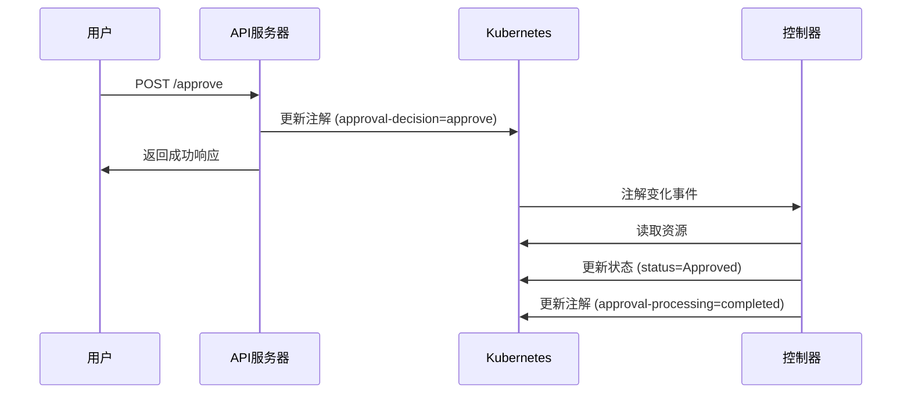

# 审批系统架构设计

## 概述

本文档说明了基于**声明式注解**的审批系统架构，该架构避免了API服务器和控制器之间的状态冲突问题。

## 设计原则

### 1. 职责分离 (Separation of Concerns)
- **API服务器**：只负责记录审批决策（注解更新）
- **控制器**：负责监控注解变化并执行状态转换

### 2. 声明式设计 (Declarative)
- API服务器声明**期望状态**（审批决策）
- 控制器确保**实际状态**与期望状态一致

### 3. 最终一致性 (Eventual Consistency)
- 系统保证最终达到一致状态
- 避免了同步状态更新的竞争条件

## 架构流程



## 注解约定

### 审批决策注解
```yaml
annotations:
  ops.udesk.cn/approval-decision: "approve|reject"    # 审批决策
  ops.udesk.cn/approval-timestamp: "2025-08-04T..."  # 审批时间
  ops.udesk.cn/approval-operator: "admin"            # 审批人
  ops.udesk.cn/approval-reason: "CPU使用率过高"        # 审批原因
  ops.udesk.cn/approval-comment: "同意扩容"           # 审批备注
  ops.udesk.cn/approval-processing: "pending|completed" # 处理状态
```

## 控制器实现

控制器需要监控 `approval-decision` 注解的变化：

```go
// 在 AlertScale 控制器的 Reconcile 方法中
func (r *AlertScaleReconciler) Reconcile(ctx context.Context, req ctrl.Request) (ctrl.Result, error) {
    var alertScale opsv1beta1.AlertScale
    if err := r.Get(ctx, req.NamespacedName, &alertScale); err != nil {
        return ctrl.Result{}, client.IgnoreNotFound(err)
    }

    // 检查是否有待处理的审批决策
    if decision, exists := alertScale.Annotations["ops.udesk.cn/approval-decision"]; exists {
        processing := alertScale.Annotations["ops.udesk.cn/approval-processing"]
        
        if processing == "pending" {
            // 处理审批决策
            switch decision {
            case "approve":
                alertScale.Status.ScaleStatus.Status = scaletypes.ScaleStatusApproved
            case "reject":
                alertScale.Status.ScaleStatus.Status = scaletypes.ScaleStatusRejected
            }
            
            // 更新状态
            if err := r.Status().Update(ctx, &alertScale); err != nil {
                return ctrl.Result{}, err
            }
            
            // 标记处理完成
            alertScale.Annotations["ops.udesk.cn/approval-processing"] = "completed"
            return ctrl.Result{}, r.Update(ctx, &alertScale)
        }
    }

    // 其他正常的 reconcile 逻辑...
    return ctrl.Result{}, nil
}
```

## 优势

### 1. 无竞争条件
- API服务器和控制器操作不同的字段
- 避免了resource版本冲突

### 2. 高可靠性
- 单次原子操作，要么成功要么失败
- 无需复杂的重试机制

### 3. 可观测性
- 审批历史完整记录在注解中
- 便于审计和调试

### 4. 扩展性
- 可以轻松添加新的审批类型
- 支持复杂的审批工作流

## 错误处理

### API服务器错误
- 注解更新失败：返回错误给用户
- 资源不存在：返回404错误

### 控制器错误
- 状态更新失败：自动重试（controller-runtime机制）
- 注解格式错误：记录错误事件，跳过处理

## 监控和告警

建议监控以下指标：
- 待处理审批数量：`approval-processing=pending`
- 审批处理延迟：`approval-timestamp` 到状态更新的时间
- 审批失败次数：控制器处理错误的统计

## 测试策略

### 单元测试
- API端点的注解更新逻辑
- 控制器的注解处理逻辑

### 集成测试
- 端到端的审批流程
- 并发审批场景
- 错误恢复场景

## 迁移指南

从重试机制迁移到声明式架构：

1. 更新API处理器（已完成）
2. 更新控制器reconcile逻辑
3. 清理旧的审批注解格式
4. 更新监控和告警规则
